# Windows Developer MCP Server

[](https://glama.ai/mcp/servers)
[](https://github.com/peeyushcodes/windows-developer-mcp/actions)
[](LICENSE)
[](https://python.org)
[](https://github.com/jlowin/fastmcp)
[](https://github.com/astral-sh/ruff)
[](https://github.com/detachhead/basedpyright)

**The production-grade, open-source Windows Developer Model Context Protocol (MCP) server.**  
*Engineered to solve the dual challenge of Glama Quality Indexing and Local LLM Execution Efficiency.*

---

## 🌟 Executive Overview

**Windows Developer MCP** is a secure, high-performance MCP server designed specifically for Windows development environments. It provides native integration with **LM Studio**, **Claude Desktop**, and other MCP-compatible clients.

Traditional MCP servers present a dilemma:

1. **Directory Ranking (Glama)** rewards exposing hundreds of fine-grained tools with extensive API coverage and comprehensive parameter schemas.
2. **Local LLMs (Gemma, Qwen 2.5, DeepSeek R1, Llama 3)** running in LM Studio have constrained context budgets (4K–16K tokens). Exposing 100+ raw tools saturates system prompts (~15K tokens), causing model paralysis, parameter hallucination, and high latency.

**Windows Developer MCP solves this with a Dual-Profile Engine and Dynamic Capability Discovery**:

- **Glama Evaluators** see a `FULL` API surface with hyper-structured Google/Sphinx style tool definitions.
- **Local LLMs** default to a `MINIMAL` profile (<10 core tools, <1.2K token footprint) and use dynamic meta-tools (`mcp_search_tools`, `mcp_enable_provider`) to discover and register domain capabilities on demand.

---

## 🏗️ System Architecture

```mermaid
flowchart TD
    Client["MCP Client (LM Studio / Claude Desktop)"]
    FastMCP["FastMCP Core Application (server.py)"]
    Registry["Provider Registry (core/registry.py)"]
    
    subgraph Profiles ["Execution Profiles"]
        P_Min["MINIMAL (Context Footprint: ~1.2K tokens)"]
        P_Dev["DEVELOPER (Balanced Footprint: ~3.8K tokens)"]
        P_Full["FULL (Glama Full Exposure: ~12K tokens)"]
    end
    
    subgraph Providers ["12 Single-Responsibility Domain Providers"]
        Terminal["TerminalProvider"]
        Filesystem["FilesystemProvider"]
        Git["GitProvider"]
        Docker["DockerProvider"]
        Python["PythonProvider"]
        Node["NodeProvider"]
        Windows["WindowsProvider"]
        SQLite["SQLiteProvider"]
        Network["NetworkProvider"]
        Project["ProjectProvider (AI Tools)"]
        GitHub["GitHubProvider"]
        Browser["BrowserProvider"]
    end

    subgraph Security ["Hardened Security Subsystem"]
        Sandbox["Workspace Sandbox (sandbox.py)"]
        Validator["Command Validator (validator.py)"]
        RateLimiter["Rate Limiter (rate_limiter.py)"]
        Logger["Audit Logger (logger.py)"]
    end

    Client -->|STDIO / JSON-RPC| FastMCP
    FastMCP --> Registry
    Registry --> Profiles
    Profiles --> Providers
    Providers --> Security
    Security -->|PowerShell 7 / Cmd Subprocess| WinOS["Windows OS"]
```



---

## ⚡ Dual-Profile Engine Comparison

| Profile | Target Environment | Active Tools | Context Footprint | Description |
| :--- | :--- | :--- | :--- | :--- |
| **`minimal`** *(Default)* | Local LLMs (7B/8B) in LM Studio | ~8 Core Tools + Meta-Tools | **~1.2K Tokens** | Low-overhead mode. Exposes core terminal, read/write, git, and project tools. |
| **`developer`** | Standard LLMs (14B/32B) / Claude Desktop | ~25 Primary Dev Tools | **~3.8K Tokens** | Balanced toolset covering standard developer workflows. |
| **`full`** | 70B+ LLMs / Glama Indexing Audits | All Registered Tools | **~12.0K Tokens** | Exposes exhaustive API surface across all 12 domain providers. |

---

## 🔌 12 Domain Providers & Capabilities

| Provider | Module | Description | Core Exposed Tools |
| :--- | :--- | :--- | :--- |
| **Terminal** | [`providers/terminal.py`](file:///c:/Users/Peeyush/terminal-mcp/providers/terminal.py) | Safe PowerShell/CMD subprocess execution | `terminal_run`, `terminal_get_session` |
| **Filesystem** | [`providers/filesystem.py`](file:///c:/Users/Peeyush/terminal-mcp/providers/filesystem.py) | Sandbox-restricted file reading, writing, tree view | `filesystem_read`, `filesystem_write`, `filesystem_list` |
| **Git** | [`providers/git.py`](file:///c:/Users/Peeyush/terminal-mcp/providers/git.py) | Working tree, commit log, diff, and branch tracking | `git_status`, `git_log`, `git_diff` |
| **Python** | [`providers/python.py`](file:///c:/Users/Peeyush/terminal-mcp/providers/python.py) | Virtual environment script execution and package check | `python_run`, `python_check_package` |
| **Node.js** | [`providers/node.py`](file:///c:/Users/Peeyush/terminal-mcp/providers/node.py) | Node execution and npm package management | `node_run`, `npm_run` |
| **Docker** | [`providers/docker.py`](file:///c:/Users/Peeyush/terminal-mcp/providers/docker.py) | Container, image, compose, and build orchestration | `docker_list_containers`, `docker_logs` |
| **Windows** | [`providers/windows.py`](file:///c:/Users/Peeyush/terminal-mcp/providers/windows.py) | System metrics, process list, and environment vars | `windows_system_info`, `windows_list_processes` |
| **SQLite** | [`providers/sqlite.py`](file:///c:/Users/Peeyush/terminal-mcp/providers/sqlite.py) | Safe SQLite database queries and schema inspection | `sqlite_query`, `sqlite_schema` |
| **Network** | [`providers/network.py`](file:///c:/Users/Peeyush/terminal-mcp/providers/network.py) | Diagnostic ping and DNS resolution | `network_ping`, `network_dns_lookup` |
| **Project** | [`providers/project.py`](file:///c:/Users/Peeyush/terminal-mcp/providers/project.py) | AI workspace analysis, security scan, docs & tests gen | `project_analyze`, `project_security_scan` |
| **GitHub** | [`providers/github.py`](file:///c:/Users/Peeyush/terminal-mcp/providers/github.py) | GitHub CLI wrapper for repos, PRs, issues | `github_auth_status`, `github_repo_info` |
| **Browser** | [`providers/browser.py`](file:///c:/Users/Peeyush/terminal-mcp/providers/browser.py) | Browser automation interface (disabled by default) | `browser_navigate` |

---

## 🧠 Native AI Developer Tools

`ProjectProvider` exposes AI-native tools for codebase comprehension:

- 🔍 **`project_analyze`**: Detects frameworks, tech stacks, and key config files automatically.
- 📦 **`project_dependencies`**: Summarizes cross-language Python/Node dependencies.
- 🌳 **`project_summarize`**: Generates a hierarchical workspace file tree.
- 🏛️ **`project_architecture`**: Detects design patterns (Provider Pattern, Layered Architecture).
- 📝 **`project_generate_readme`**: Generates a complete, structured README markdown draft.
- 📚 **`project_generate_docs`**: AST-based docstring extraction for Python source files.
- 🛡️ **`project_security_scan`**: Static pattern audit for hardcoded API keys and credentials.
- 🧪 **`project_generate_tests`**: Generates pytest unit test skeletons for source files.

---

## 🛡️ Security & Sandbox Architecture

1. **Workspace Boundary Sandbox ([`security/sandbox.py`](file:///c:/Users/Peeyush/terminal-mcp/security/sandbox.py))**: Strict path normalization prevents path traversal out of workspace root (`../..`).
2. **Command Validation Engine ([`security/validator.py`](file:///c:/Users/Peeyush/terminal-mcp/security/validator.py))**: Regex denylists block destructive operations (`shutdown`, `format c:`, `del /f /s /q`, `net user admin`).
3. **Rate Limiter ([`security/rate_limiter.py`](file:///c:/Users/Peeyush/terminal-mcp/security/rate_limiter.py))**: Sliding-window execution limiter protects against command loops.
4. **Structured Audit Logging ([`security/logger.py`](file:///c:/Users/Peeyush/terminal-mcp/security/logger.py))**: All executed commands, timestamps, exit codes, and output sizes are logged to `logs/audit.log`.

---

## 🚀 Quick Start

### 1. Installation with `uv`

```bash
# Clone repository
git clone https://github.com/peeyushcodes/windows-developer-mcp.git
cd windows-developer-mcp

# Synchronize dependencies with uv
uv sync
```

### 2. Launch Server

```bash
uv run windows-developer-mcp
```

---

## 💻 LM Studio & Claude Desktop Integration

### LM Studio Setup

Add to your LM Studio MCP server configuration file:

```json
{
  "mcpServers": {
    "windows-developer-mcp": {
      "command": "uv",
      "args": [
        "--directory",
        "C:\\path\\to\\windows-developer-mcp",
        "run",
        "windows-developer-mcp"
      ],
      "env": {
        "MCP_SERVER__PROFILE": "minimal",
        "MCP_WORKSPACE__PATH": "C:\\path\\to\\workspace"
      }
    }
  }
}
```

### Claude Desktop Setup

Add to `%APPDATA%\Claude\claude_desktop_config.json`:

```json
{
  "mcpServers": {
    "windows-developer-mcp": {
      "command": "uv",
      "args": [
        "--directory",
        "C:\\path\\to\\windows-developer-mcp",
        "run",
        "windows-developer-mcp"
      ],
      "env": {
        "MCP_SERVER__PROFILE": "developer",
        "MCP_WORKSPACE__PATH": "."
      }
    }
  }
}
```

---

## 📖 Comprehensive Documentation Suite

- 📐 [Architecture Overview](docs/architecture.md)
- 🔌 [Provider Reference](docs/providers.md)
- 🛡️ [Security Model](docs/security.md)
- 🤝 [Contributing Guide](docs/contributing.md)
- 💡 [Usage Workflows & Examples](docs/examples.md)
- 🤖 [LM Studio Setup Guide](docs/lm_studio_setup.md)
- 🖥️ [Claude Desktop Setup Guide](docs/claude_desktop_setup.md)
- 🖼️ [Screenshots & Visual Assets Plan](docs/screenshots_plan.md)
- 📋 [Glama Manifest (glama.json)](glama.json)
- 📜 [Changelog](CHANGELOG.md)

---

## 📄 License

Distributed under the MIT License. See [LICENSE](LICENSE) for details.
